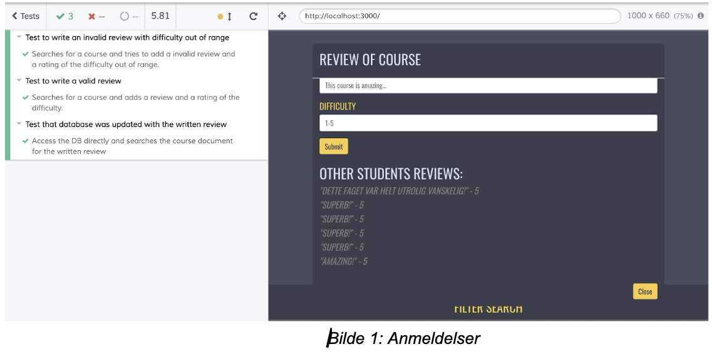
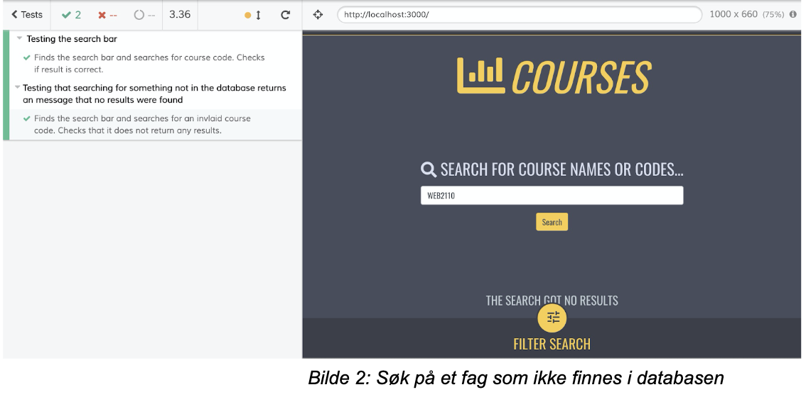
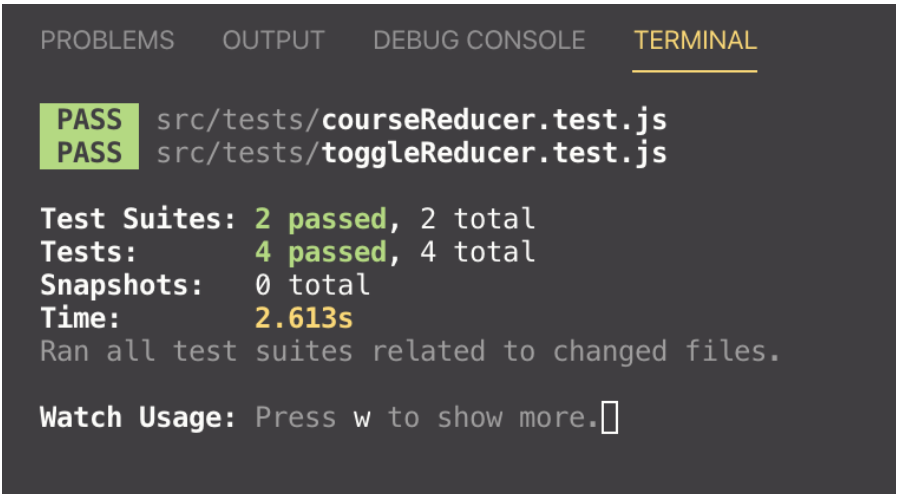

# IT2810 Prosjekt 3 - Gruppe 39

## Innhold og funksjonalitet i brukergrensesnittet

Prosjekt 3 i IT2810 er å lage en fullstack nettapplikasjon, der en bruker kan søke på objekter i en database.
Vi valgte å lagre og håndtere emnedata fra fag på NTNU med fagkoder som begynner på TDT, TTM, TMA, IT og TFY, og deres tilhørende karakterstatistikker for ulike eksamener. 
For å fylle opp databasen med relevant data har vi scrapet grades.no sitt API, og lagt det inn på vår egen database som kjører på NTNU-server. 
  
Klientapplikasjonen består av et søkefelt der brukeren kan søke på enten fagkode eller fagnavn. 
Etter søket har blitt gjennomført vil resultatene bli kortfattet presentert i en listebasert visning under søkefeltet, og muligheter for filtrering og sortering vil også bli tilgjengelig.
Når brukeren scroller til bunnen av siden, vil det automatisk lastes inn flere fag dersom det er er tilgjengelig.  


Ved å trykke på et av fagene vil det bli presentert mer informasjon om faget, i tillegg til at brukeren får mulighet til å se tidligere anmeldelser for faget, i form av en kommentar og en vurdering av vanskelighetsgrad fra 1-5. 
Brukeren kan også legge til en anmeldelse på fag selv, som vil lagres i databasen. For hvert fag er også karakterstatistikk fra alle registrerte semestre tilgjengelig.


## Teknologi

### Backend

**MongoDB, Express og Node**  
Vi så det som hensiktsmessig å dele opp prosjektet for i en frontend-mappe og en backend-mappe, med individuelle package.json-filer. 
Dette er fordi frontend- og backend-delen av prosjektet har få felles dependencies, og det er god praksis samt mer oversiktlig og ha det separert. 
Når man kloner prosjektet må man derfor kjøre `npm install` i både frontend- og backend-mappen. 
Etter alle dependencies er installert må man kjøre kommandoen `npm start` fra backend-mappen for å kjøre backend-serveren lokalt på port 3001.

Her er en oversikt over de viktigste filene i backend-delen av prosjektet vårt:


```
backend/
│
├── server.js 
├── package.json
└── models/
│	├── course.model.js
│	└── grades.model.js
└── routes/
	├──	course.js
	└── grades.js
```


I dette prosjektet var det et krav om en database installert på en virtuell maskin, og å sette opp et REST API (alternativt GraphQL) implementert med node/express på server. 
Vi valgte å benytte oss med MongoDB som database, og brukte Express.js for å sette opp et REST API. 
Grunnen til dette var at det var mye god dokumentasjon tilgjengelig for denne MERN-stacken (MongoDB, Express, React, Node). 
Felles for disse fire teknologiene er at alle er basert på JavaScript, som gjør at vi kun trenger å forholde oss til ett programmeringsspråk for hele applikasjonen. 

**Database - MongoDB**  
MongoDB er en såkalt NoSQL-database (Not Only SQL). NoSQL-databaser har mange fordeler, deriblant at databasen er veldig skalerbar, den har høy ytelse og det er enkelt å fylle opp databasen med JSON/XML-filer.
Ved bruk av MongoDB Compass kunne vi importere JSON-filer til databasen gjennom et GUI, som gjorde jobben med å fylle databasen med data betydelig mye lettere enn å legge inn ett og ett fag manuelt.

I databasen vår har vi 180 NTNU-fag hentet fra grades.no sitt API. For å få tak i denne dataen lagde vi et Python-script som scrapet APIet for de fagkodene vi ønsket, og konverterte dette til JSON. 
Deretter gjensto det kun å laste dette opp i databasen. 

Databasen kjører til enhver tid på en virtuell maskin som kan aksesseres på http://it2810-39.idi.ntnu.no:27017/courses dersom man har de riktige tilgangene. 
I praksis er det kun Express som får hentet ut data fra databasen gjennom nettsiden, da man trenger brukernavn og passord for å få tilgang.

Vi har valgt å strukturere databasen vår i to collections; courses og grades. 
Skulle vi vevd grades inn under hvert enkelt course-dokument, ville hvert course-objekt blitt ufattelig stort og uoversiktlig, og dermed anså vi det som hensiktsmessig å separere disse. 

**Express.js**  
Express.js er et JavaScript web framework basert på Node.js. Vi har brukt Express.js for å lage et REST (REpresentational State Transfer) API med Node.
Kort forklart er et REST API en arkitektur for å sette opp API. APIet fungerer som en server for frontenden, men er en klient for databasen.

En enkel illustrasjon av kommunikasjonen mellom frontend og backend:

```

Frontend (React) <==> REST API (Express/Node) <==> Backend (MongoDB)


```
Express gjør enkelt for frontend å sende forespørsler til databasen, ved at selve spørringen bare kan legges til i slutten av den faste URL-en, og dataen vil da bli returnert i JSON-format dersom det er tilgjengelig.
Fordelen med at all kommunikasjon APIet er mellomleddet, er blant annet at front- og backend ikke trenger å være skrevet i samme programmeringsspråk, ettersom all dataen som går gjennom et REST API er HTTP-requests, og innholdet i meldingene enten er på JSON- eller XML-format. 

Det finnes mange typer HTTP-requests, der de vanligste er GET, POST, PUT og DELETE. For vårt prosjekt var det mest naturlig å kun ha med GET og PUT/POST, da det ikke er ønskelig at brukere skal ha mulighet til å slette ting fra databasen, men kun mulighet til å skrive en anmeldelse av et fag til databasen. 
Dette kan gjøres med å bare initiere én instans av express:

```javascript
app = express()
```

For å angi hva som skal skje med HTTP-requests kan man eksempelvis skrive følgende:

```javascript
app.get(function (req, res) {
	res.send(“Hello world!”)
}
```
Da vil “Hello world” sendes som en HTTP-respons tilbake til den som sendte HTTP GET-requesten.
Tilsvarende er det for de andre HTTP-requestene (app.put(), app.post()).

Det at man enkelt kan begrense tilganger til databasen ved hjelp av Express er en annen fordel. Express er også et av de mest populære web-rammeverkene, og dermed er det et stort økosystem av middleware (det som behandler dataen som går gjennom APIet) tilgjengelig. Eksempelvis benytter vi oss av bodyParser, som konverterer bodyen i en HTTP-request til JSON-format. 

Sist, men ikke misnt så modellerer Express dataen for oss, slik at spørringer til databasen er lett å utføre.
I backend/models ligger det to filer som representerer hver sin collection i databasen, og er knyttet opp mot MongoDB gjennom et bibliotek kalt Mongoose.

**Node.js**  
Noe forenklet kan man si at Node.js gjør at man kan skrive backend-/server-koden i JavaScript. I utgangspunktet kan ikke Node kjøre moderne JavaScript - som f.eks. ES6, men ved bruk av kompilatoren Babel blir dette muliggjort. Babel transpilerer moderne JavaScript til vanilla JavaScript for oss. 
For å få det til å skje har vi endret “npm start”-scriptet i package.json for backend til følgende: 

```javascript
nodemon ./server.js --exec babel-node
```

Som man kan se brukes også Nodemon. Det er et verktøy som ser etter endringer i koden, og automatisk restarter serveren dersom noe har blitt endret. Dette har vært en stor fordel under utvikling da det er svært tidsbesparende.

### Frontend  


Gjennom prosjektet har vi prøvd å finne relevante biblioteker og komponenter, og vi har blant annet tatt i bruk [React-Bootstrap](https://react-bootstrap.github.io/) som komponent- og styling- rammeverk. 
Bootstrap for React kommer med ferdigbygde React-komponenter som kan tas i bruk ved import. 
Siden React Bootstrap er helt basert på [Bootstrap-rammeverket](https://getbootstrap.com/) kommer disse ferdigstylet men man kan velge å beholde som de er eller å legge til egen styling.
Det kan også brukes innebygde Bootstrap-klasser på elementer og komponenter som gir mulighet for å bygge bl.a. responsive grid-systemer uten ekstra css-kode. 
Vi valgte derfor å ta i bruk dette rammeverket, da det forenklet hele denne prosessen for oss.

Vi har også tatt i bruk noen andre React-biblioteker med relevante funksjonaliteter, blant annet [Animated-biblioteket fra react-animated-css](https://www.npmjs.com/package/react-animated-css) som inneholder en del animasjoner. Det har vi brukt til for eksempel pop-up av filtermenyen.Vi hasr også tatt i bruk [react-recharts](http://recharts.org/en-US) som har blitt benyttet til visuell visning av karakterstatistikk.

Det har også blitt brukt diverse ikon-biblioteker fra [fontawesome](https://fontawesome.com/) og [material-icons](https://material.io/resources/icons/?style=baseline) for å hente ut ulike ikoner på siden. 

Da det er brukt state i de fleste komponentene gjennom Redux og dette har vært enklest å strukturere og implementere gjennom klassekomponenter har vi valgt å ta i bruk dette der det har vært nødvendig.
Funksjonelle komponenter er da brukt der vi ikke har hatt behov for hente state med redux.

### React Redux

Vi har brukt React Redux for state management i dette prosjektet, som gjør at states og actions kan nås og brukes globalt som props av alle komponenter. 
De blir tilgjengelige for alle filene som er child components av App.js, da den er wrappet i en Provider som ved render “leverer” det som ligger i store videre nedover i hierarkiet.
Dette gjør at det er betydelig mye enklere å bruke og oppdatere statene i alle komponentene der det er ønskelig, da de blir tilgjengelig etter import og konfigurering i den innebygde funksjonen mapStateToProps. 

Vi har valgt å strukturere det slik at filene sorteres etter hvilken React Redux-funksjon de har: store og initialState er lagret i mappen store, action creators og actionTypes i mappen action, og reducers og combineReducer er lagret i mappen reducers.
Action-filer og deres tilhørende reducere er intuitivt navngitt, f.eks. filterAction.js og filterReducer.js, slik at det skal være lett å se hvilke actions og reducers som hører sammen selv om de er i ulike mapper.
Her er en grov oversikt over mappehierarkiet:
```
frontend/
│
├── actions/
│   ├── actionTypes.js
│   ├── courseActions.js
│   ├── …
│   └── toggleActions.js
│	
├── components/
│   ├── Button.js
│   ├──	…
│   └── SearchBar.js
│ 		
├── css/
│   ├──	button.css
│   ├──	…
│   └──	searchBar.css
│		
├── reducers/
│   ├──	combineReducers.js
│   ├──	courseReducer.js
│   ├──	…
│   └── toggleReducer.js
│		
├── store/
│   ├── initialState.js
│   └── store.js
│
├── App.js
└── index.js

```

Vi benytter **Axios** for å hente ut data fra databasen, og denne dataen lagres i tilhørende state. 
Data hentes ut ved at URL-en tilpasses etter hva som er søkt, filtrert eller sortert på. 
Når brukeren velger å spesifisere disse valgene, lagres de i state og legges til i URL-en.
Den siste HTTP-requesten som har blitt utført lagres alltid i query-staten, slik at man kan ta utgangspunkt i den når det legges til flere detaljer ved søket.

For å håndtere asynkrone actions som kommuniserer med databasen brukes Redux Thunk som middleware. 
Henting av data har blitt delt opp i tre synkrone action creators; BEGIN, SUCCESS og FAILURE, som alle returnerer vanlige action-objekter. 
Disse er igjen samlet i en action creator som returnerer en funksjon som mottar dispatch-metoden fra store, i stedet for et vanlig action objekt. 
På denne måten blir det mindre problematisk med actions som er asynkrone.

## Testing

Et krav i dette prosjektet var å vise at man behersker grunnleggende end-to-end testing. 
For å tilfredsstille arbeidskravet om å beherske grunnleggende automatisert end-to-end-testing har vi benyttet oss av Cypress for å lage noen tester som verifiserer at det brukeren skriver til databasen faktisk blir lagt inn, og at man får ut riktig data ved søk. 
  
Den eneste formen for brukergenererte data som tas inn er anmeldelser (kommentar og vanskelighetsgrad) av et emne. 
Vi har derfor en test som sjekker at bruker ikke kan sende inn en anmeldelse med vanskelighetsgrad utenfor intervallet 1-5, og en test som sjekker at anmeldelsen som ble skrevet faktisk ligger i databasen, se Bilde 1.
  
Vi har også en test som sjekker at man faktisk får frem riktig søkeresultat når man utfører et søk, og også en som sjekker at man får en beskjed om at et søk ikke har noen treff dersom man søker etter noe som ikke ligger i databasen, se Bilde 2.



  


Det er mulig å kjøre testene lokalt selv. For at frontend- og backend-server skal kjøre må man kjøre kommandoen “npm install” fra både /,   /backend og /frontend. Start serverne opp med kommandoen “npm start” fra /backend og fra /frontend. 
Begge serverne må kjøre samtidig. Begge testfilene ligger lokalisert under /cypress/integration/.

Etter dette må man starte opp Cypress med kommandoen “/node_modules/.bin/cypress open”. Begge testene blir da tilgjengelig til å kjøres fra det grafiske grensesnittet til Cypress. (Cypress kan av og til bruke lang tid på å starte opp, så ha litt is i magen).


Vi har også laget noen enkle enhetstester med Jest, som tester to av reducerne og sjekker at de oppdaterer statene riktig. 
Der har vi to tester for hver av de to reducerne som sjekkes; courseReducer og toggleReducer. 
For courseReducer testes det at dersom ingen action type sendes inn, så skal den returnere initialState, og `SEARCH_COURSE` testes for å sjekke at text-staten blir oppdatert med det som sendes inn.
For toggleReducer  testes både `TOGGLE_FILTER`  og `TOGGLE_MODAL`, der staten for de aktuelle actionene blir det motsatte av det som sendes inn.



På bildet ovenfor ser man at begge testene ble “godkjent”, altså at statene oppdaterte seg riktig i sammenheng med slik det var tiltenkt. 

## Bruk av Git

Vi har aktivt brukt Git under dette prosjektet også. Vi brukte igjen branchen ‘dev’ som en midlertidig masterbranch, og tok utgangspunkt i denne når vi skulle merge. 
‘dev’ skulle merges med master som aller siste steg i utviklingen av prosjektet. Andre brancher ble i starten litt vagt navngitt i forhold til oppgaven den skulle arbeide med, men dette ble mer og mer spesifisert etter hvert. 


I dette prosjektet har vi også forbedret oss til at vi nå tagger issue-nummeret som committen bidrar til i commit-meldingen. 
Dette gjelder i hovedsak commits der betydelige endringer har blitt gjort, så det er fortsatt en del commits som ikke inkluderer tag da det ikke nødvendigvis er knyttet opp med en spesifikk issue. 

## Andre kilder

https://alligator.io/redux/redux-thunk/  
https://redux.js.org/introduction/getting-started  
https://www.robinwieruch.de/node-express-server-rest-api  


